# First real workflow

## Scenario
The objective of this lab is to understand the basic constructs of building a workflow. In this lab, we'll expose a simple HTTP endpoint which validates the inputs and writes the result to an azure storage account. 

During the lab, we'll introduce the HTTP Trigger action and use the Azure Storage Connector and introduce the concept of validating data represented in Javascript Object Notation (JSON) which has become a standard format for data exchange between different systems. We'll also cover a little about writing expressions and reporting run history.

## Setting up the lab

If you haven't already, you'll need to provision your Azure Logic Apps Standard Environment. To do this you'll use the command `azd up` from the terminal window.

### Steps 1 - Opening the environment

- In the Azure Portal window (https://portal.azure.com) locate your resource group, which should be similar to `rg-logicapps-INITIAL`. Inside, you should find three Azure Resources have been created.

- ℹ️ *Note: There may be other resources automatically created in the resource group, but these are not needed for this lab and can be ignored for now.*

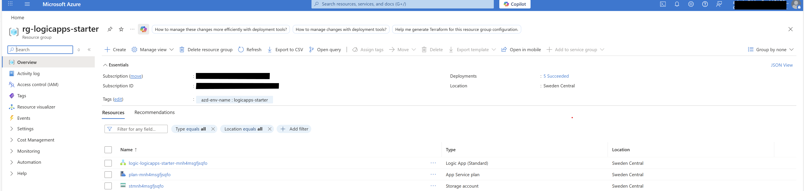

- Logic Apps Environment
- App Service Plan - for hosting the Logic Apps
- Storage Account - for storing state of your logic apps, don't worry about this yet - we'll be using this later.

### Step 2 - Opening your Logic App Resource
For this lab, we'll be build our workflow using the on-line designer in the Azure Portal. 

1. Open the Logic app resource by clicking on the logic app resource link

    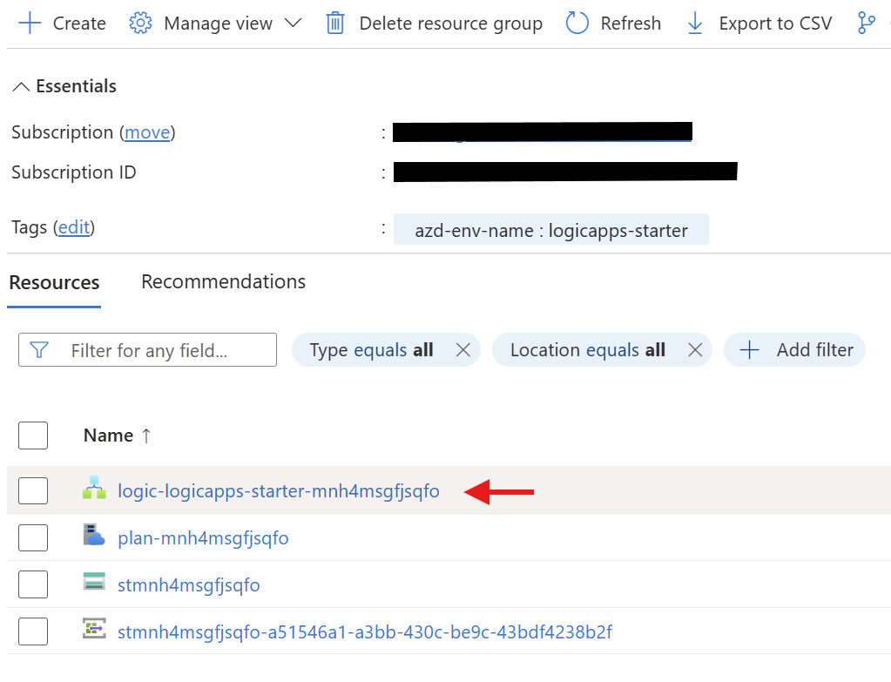


### Configure Identity 

To create connections and effeciently secure your Azure resources to your workflows the workflow needs to be configured with an Identity. You can choose the Identity or have the system automatically create one.

1. Open the Identity Section

    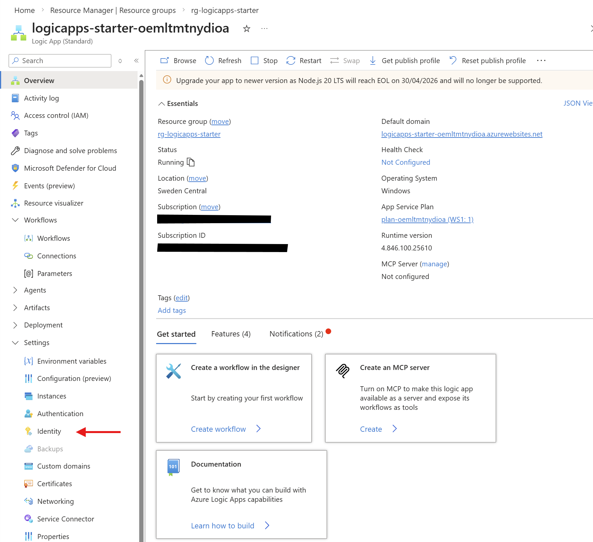

2. Confirm the deployment has assigned a User Managed Identity

    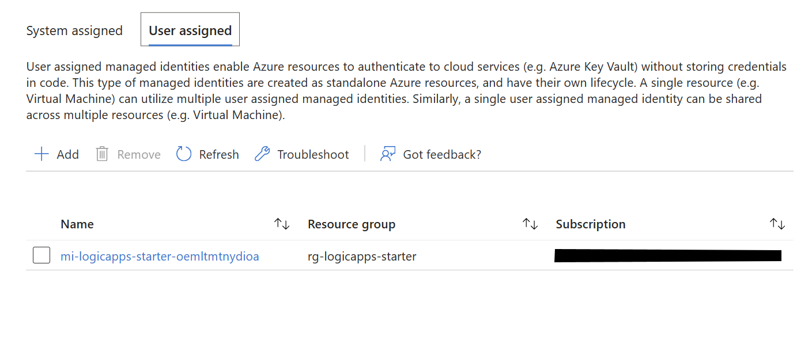

Managed Identities enhance security and avoid the need to share passwords and secrets, effectively identifying your Azure Logic App Environment. When the environment is deleted, the System Managed Identities are automatically cleaned up.

3. Save the Configuration and wait for the page to refresh.
4. Click the `Azure Role Assignments` button
    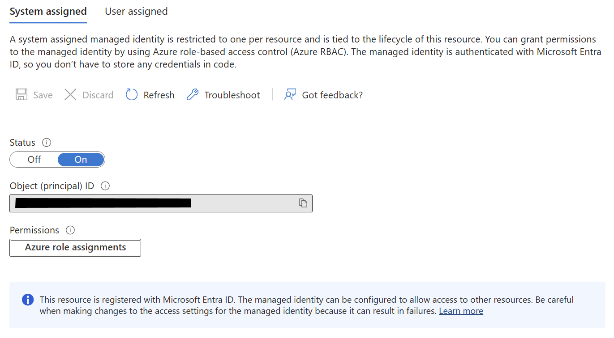

5. In the assignments option choose Storage from the Scope
6. Locate the storage account name that was listed in your resource group - It'll probably start with st

    

6. We'll choose Contributor for our role here, but we'd use more fine grain controls in production.

### Step 3 - Creating our first workflow

This will open the Azure Logic Apps blade. For standard Logic Apps, multiple workflows can be hosted in the plan. We'll find all our **workflows** under the Workflow section, where we'll also find our **connections** and and **Parameters**

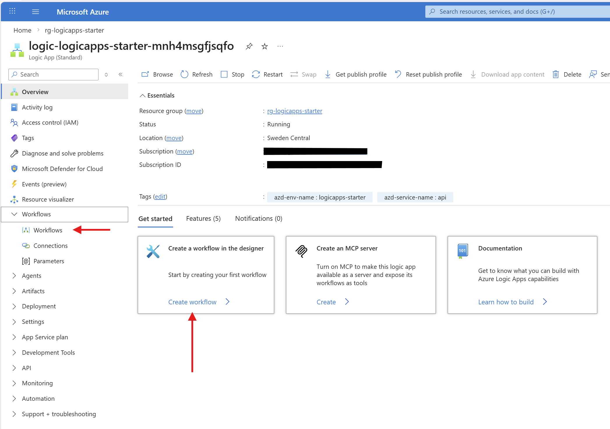

1. Create a new workflow either by open the Workflows section and choosing Create OR click the Quick Link from the main pane to open the **Create workflow** form
2. Name the workflow **OrderSupplies** 
3. Choose Stateless for the workflow type.
4. Click **create** button to create the workflow

    

### Step 4 - Open the workflow
From the workflow pane, choose the Workflow you've just created to open it in the designer. 

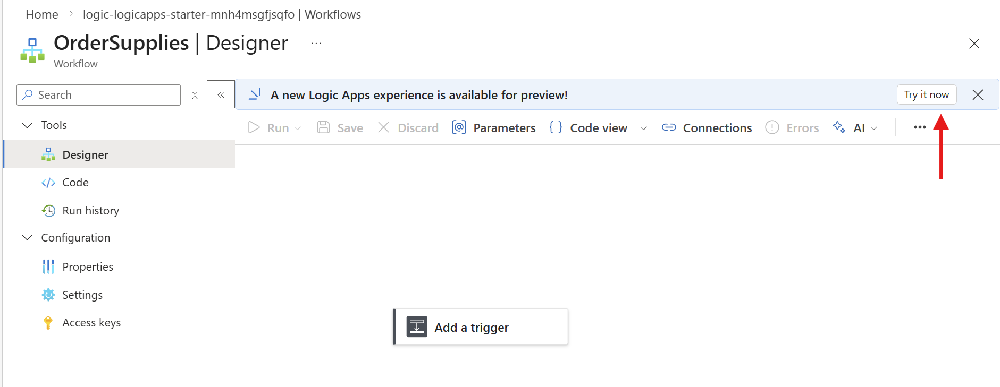

If a banner appears about the new Logic Apps experience - select try it now. The new preview mode gives a modern and faster design surface.

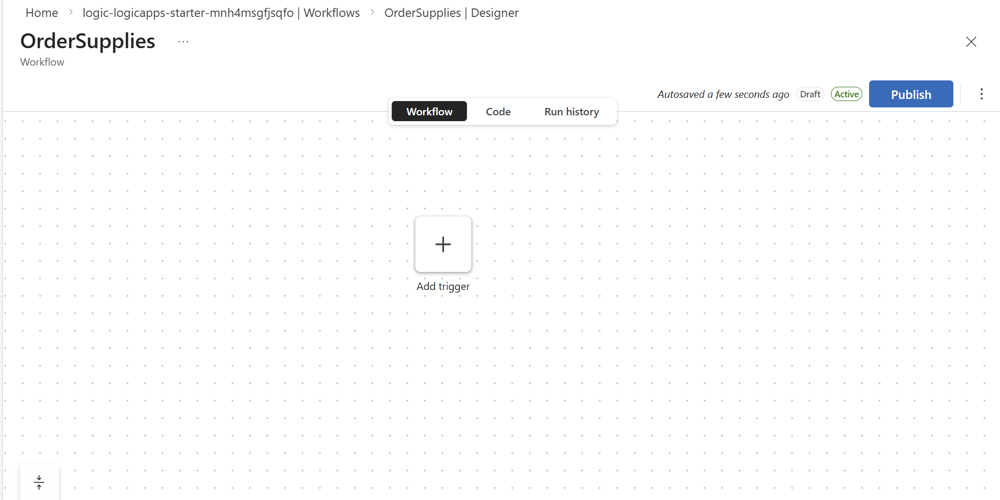

### Step 5 - Adding the Trigger
We're going to add the trigger to our workflow to enable it to respond 

1. Press the + Add Trigger button. On
2. Ot the right hand panel select the `When an HTTP Request is received` option. 

    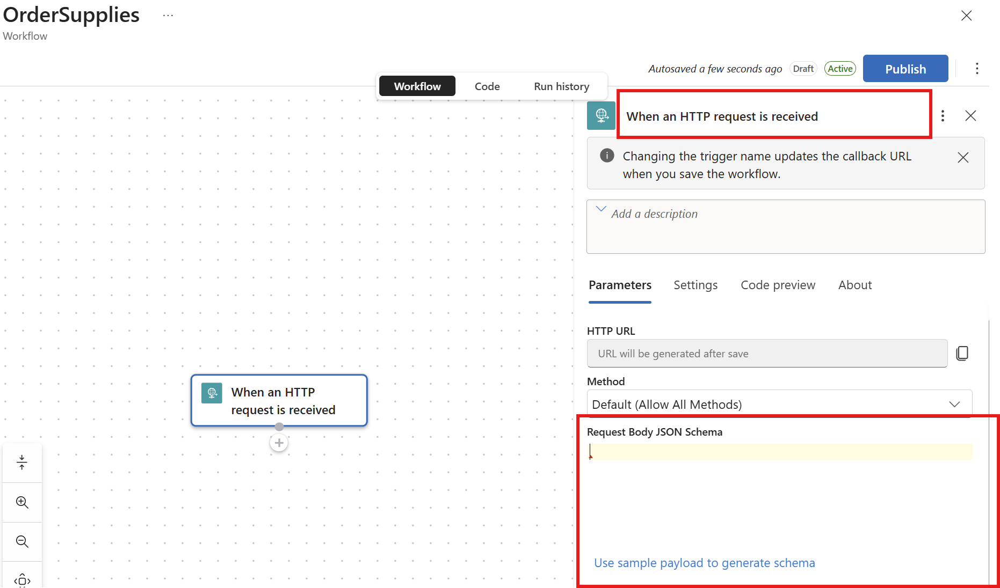

    You can rename the action so you can more easily refer back to it later in the workflow. The trigger also has an _optional_ description field to help document the trigger.

    The important part here is the request body. The trigger assumes that the body will contain a request expressed in Javascript Object Notation (JSON) format. 
    
    There are two ways to create the body either by 
        - (1) Declaring the JSON schema into the field or 
        - (2) with an example request which we can infer the schema from.

3. For now, choose "Use a sample payload to generate schema" and paste the following JSON into the request

    ```json        
    {
        "item" : "Printer Paper 80GSM",
        "qty" : 500,
        "priority" : "Urgent"
    }
    ```

4. Change the Method in the drop down to POST


### Step 6 - Adding a Response
On receving the message, we'd like our workflow to acknowledge the request and response with a status code

1. Click the + icon underneath the HTTP Trigger Action and add a new action

    

2. Choose the Response Action
3. In the body of the response, we'll construct a reply using some of the fields we extracted from the request.
4. In the body field, hover with the mouse until the Choose the blue action and function tool tip appears
5. Select the  _fx_ button
6. In the expression editor choose the string concat function.
7. Enter the string in the concat function to compose a string for the body `concat('you ordered ', triggerBody()?['item'])`


4. You can now Publish the workflow.

Once the workflow has saved, you should open the workflow and check the HTTP action URL has been populated.

### Step 7 - Testing the workflow

We can now test the workflow. The Visual Studio Code **REST Client Extension*** provides a quick way to test out our HTTP trigger.

 To test our your workflow from Visual Studio Code go to the `Test.http` file 

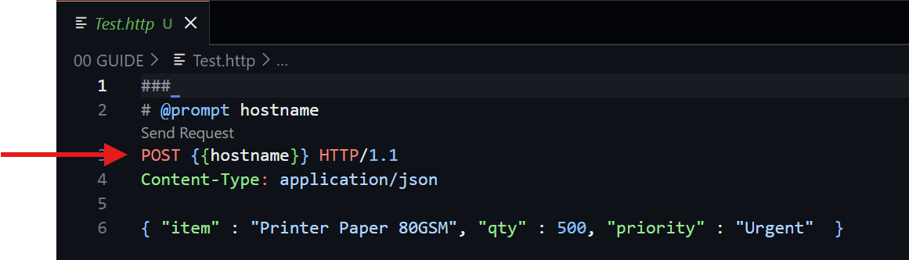

You'll notice a few things in this file. The `@prompt` for a `hostname` variable which you'll see is passed to the POST together with an example content body

You should also see a Send Request link.

1. Click the Send Request link, which should prompt for the hostname
2. Copy the Http Client URL from your workflow

    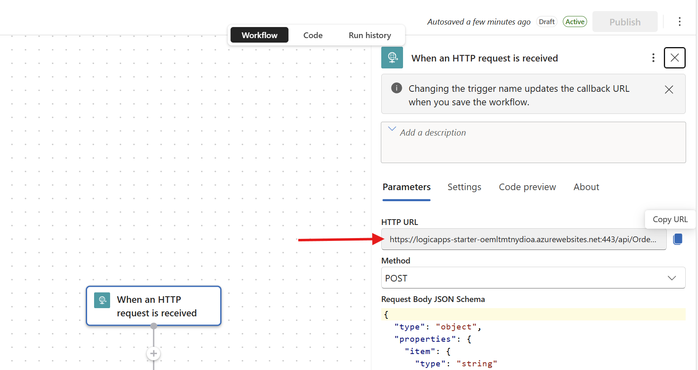

3. Paste the URL into the prompt in Visual Studio Code and press ENTER

    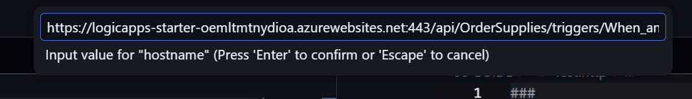

4. If everything is working correctly, you should get a response similar to 

    ```
    HTTP/1.1 200 OK
    Connection: close
    Content-Type: text/plain; charset=utf-8
    Date: Wed, 04 Mar 2026 01:22:20 GMT
    Content-Encoding: gzip
    Transfer-Encoding: chunked
    Vary: Accept-Encoding
    x-ms-workflow-run-id: 08584290195460867752196857464CU00
    x-ms-correlation-id: a4cf0c5a-6c6b-4df7-9a49-e04a6f6510dd
    x-ms-client-tracking-id: 08584290195460867752196857464CU00
    x-ms-trigger-history-name: 08584290195460867752196857464CU00
    x-ms-workflow-system-id: /scaleunits/prod-00/workflows/a707024c04fe4a518cf13a0ed8cebf2a
    x-ms-workflow-id: a707024c04fe4a518cf13a0ed8cebf2a
    x-ms-workflow-version: 08584290195824821748
    x-ms-workflow-name: OrderSupplies
    x-ms-tracking-id: a4cf0c5a-6c6b-4df7-9a49-e04a6f6510dd
    x-ms-request-id: :a4cf0c5a-6c6b-4df7-9a49-e04a6f6510dd

    you ordered Printer Paper 80GSM
    ```


