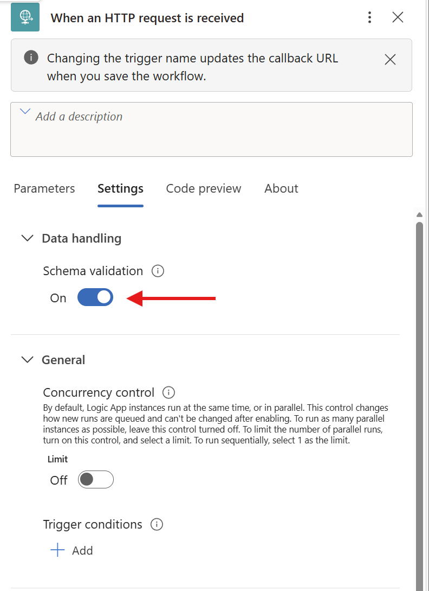
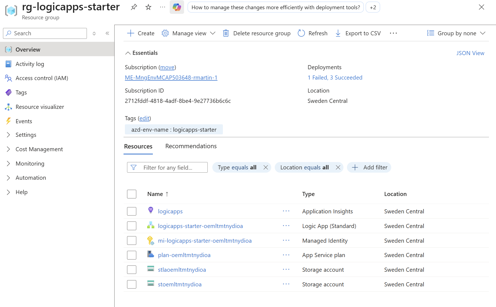
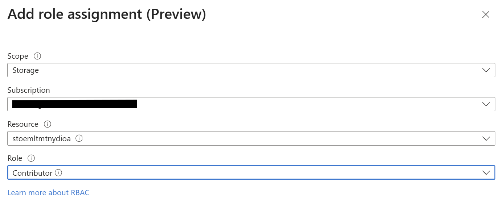
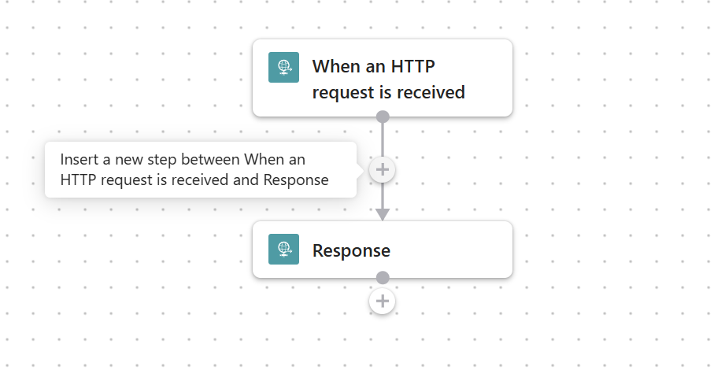
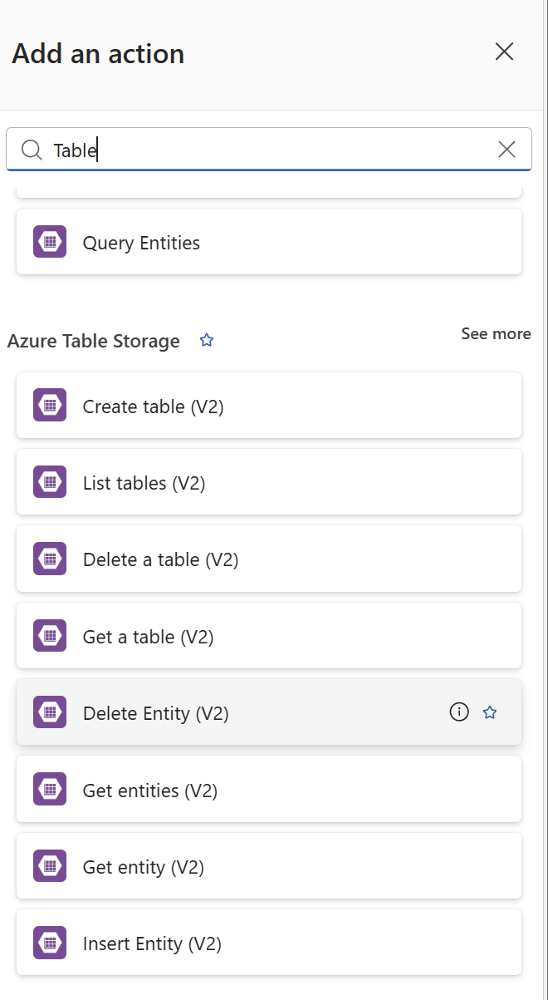
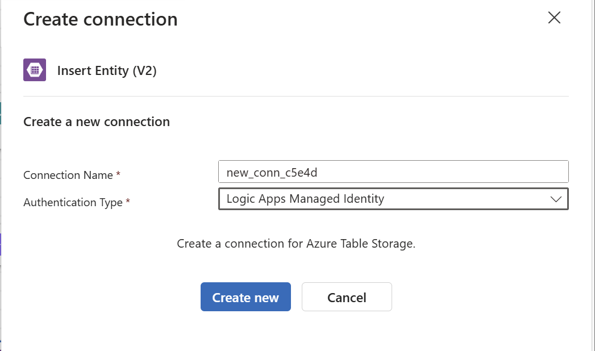
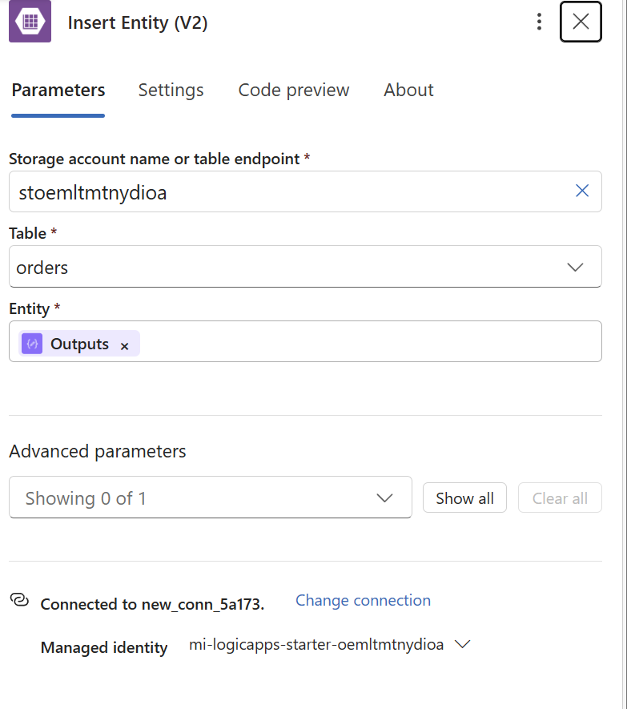
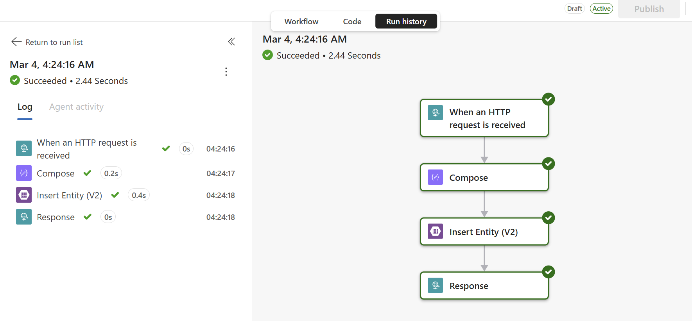

# 02 - Integration Patterns

Our workflow was very simple, but we need to adapt it to become more business ready. In this lab we're going to improve the workflow, introduce error handling and collecting orders for processing later

## Scenario

We're going to adapt the workflow to add orders to a table and gracefully react to incorrect inputs and errors.

## Setting up the lab

> Complete Lab1 before moving on to this exercise

### Step 1 - What happens if the request isn't quite right?

We've added some additional test cases for this lab. You'll notice the new test file has several different tests we can try. Go to the first test and use the Send Request link. 

```http
###
# @prompt hostname
POST {{hostname}} HTTP/1.1
Content-Type: application/json

{ "product" : "Printer Paper 80GSM", "qty" : 500, "priority" : "Right Now"  }
```

1. Use the `Lab 02 - Test.http` like we did before.

    The request looks reasonable, but notice what happens? The workflow completed successfully, but the response showed a blank product was received.

    ```http
    HTTP/1.1 200 OK
    Connection: close
    Content-Type: text/plain; charset=utf-8
    Date: Wed, 04 Mar 2026 02:49:05 GMT
    Content-Encoding: gzip
    Transfer-Encoding: chunked
    Vary: Accept-Encoding
    x-ms-workflow-run-id: 08584290143402151988728929011CU00
    x-ms-correlation-id: 28337c8f-1419-42e1-b183-67fb3d71fdfa
    x-ms-client-tracking-id: 08584290143402151988728929011CU00
    x-ms-trigger-history-name: 08584290143402151988728929011CU00
    x-ms-workflow-system-id: /scaleunits/prod-00/workflows/233c06496a434e75912be81cfc462166
    x-ms-workflow-id: 233c06496a434e75912be81cfc462166
    x-ms-workflow-version: 08584290147179903206
    x-ms-workflow-name: OrderSuppliesV2
    x-ms-tracking-id: 28337c8f-1419-42e1-b183-67fb3d71fdfa
    x-ms-request-id: :28337c8f-1419-42e1-b183-67fb3d71fdfa

    you ordered 
    ```

### Step 2 - Validating the requests

We'll update the schema for our HTTP Request Trigger to add schema validation and check for obvious format errors. 

1. Copy the following schema and update the schema

    ```json
    {
    "type": "object",
    "properties": {
        "item": {
        "type": "string"
        },
        "qty": {
        "type": "integer",
        "minimum": 1
        },
        "priority": {
        "type": "string",
        "pattern": "^(high|medium|low)$",
        "description": "Allowed values: high, medium, low (case-insensitive)"
        }
    },
    "required": ["item", "qty", "priority"],
    "additionalProperties": false
    }
    ```

2. Move to the Setting section of the HTTP Trigger and enable Schema Validation

    

3. Retest the HTTP Trigger again using the same test. Notice the response contains an error response and returns a 400 status code.

    ```json
    HTTP/1.1 400 Bad Request
    Connection: close
    Content-Type: application/json; charset=utf-8
    Date: Wed, 04 Mar 2026 02:57:54 GMT
    Transfer-Encoding: chunked
    x-ms-workflow-system-id: /scaleunits/prod-00/workflows/233c06496a434e75912be81cfc462166
    x-ms-workflow-id: 233c06496a434e75912be81cfc462166
    x-ms-workflow-version: 08584290138267228796
    x-ms-workflow-name: OrderSuppliesV2
    x-ms-tracking-id: 66331728-dc33-4022-b5ab-34601e702464
    x-ms-request-id: :66331728-dc33-4022-b5ab-34601e702464

    {
    "error": {
        "code": "TriggerInputSchemaMismatch",
        "message": "The input body for trigger 'When_an_HTTP_request_is_received' of type 'Request' did not match its schema definition. Error details: 'Property 'product' has not been defined and the schema does not allow additional properties.,String 'Right Now' does not match regex pattern '^(Urgent|Normal|Low)$'.,Required properties are missing from object: item.'."
    }
    }
    ```

### Step 3 - Writing the request to storage

The workflow handles bad inputs now, and returns an error code to the client. We can now add additional steps to write the order to a table, so we can group peoples orders together and periodically run a task to replenish stock.

We'll first need to ensure our Workflow has access to the storage account where we have will write our tables.

1. Go to the resource group 
2. Note the Managed Identity and the two storage accounts. The one we are interested in is the shorter named one. 

3. Select the Managed identity for your Logic App. It'll start with mi in this lab

    

4. Choose Azure Role Assignments. 
5. If the resource doesn't have Contributor access to the storage account, select Add Role Assignment
6. Choose Storage for the Scope
7. Choose the storage account
8. Choose the Contributor Role

    

### Step 4 - Writing to the table storage

1. Insert a new step after the HTTP Trigger

    

2. Select `Add an Action` 
3. In the Add an Action box - search for Compose

> The Compose action enables us to create a JSON object and replace the values with expressions or dynamic values from other workflow actions.

4. In the compose field, we're going to enter the following partial JSON object which we will complete with the workflow properties from other actions.

```json
{
  "PartitionKey": "order",
  "RowKey": ,
  "Item": ,
  "Qty": 
}
```


The complete compose value looks like the following, which you can check using the Code Preview section 

```json
{
  "PartitionKey": "order",
  "RowKey": @{guid()},
  "Item": @{triggerBody()?['item']},
  "Qty": @{triggerBody()?['qty']}
}
```

4. Now add a new Action under the Compose action from the search use Table 

    

5. Add the Insert Entity (V2) Action

6. You'll need to create a connection. Choose Logic Apps Managed Identity 

    

7. For the storage account name, enter the name of the storage account if it doens't appear in the drop down

    

8. The Table field should populate, and you can choose the orders table

9. For the entity Click the Lightening Icon

10. Choose Composer and select Outputs - this used the output from the action

11. Save / Publish your updated workflow

### Testing the workflow

We can now test the workflow again. Use the last test from the `Lab 02 - Test.http` this should create a valid request to add writing pad to the order table.

```json
###
# @prompt hostname
POST {{hostname}} HTTP/1.1
Content-Type: application/json

{ "item" : "Writing Pad", "qty" : 21, "priority" : "Normal"  }
```

If everything has gone correctly, you should get a response similar to the

```json
HTTP/1.1 200 OK
Connection: close
Content-Type: text/plain; charset=utf-8
Date: Wed, 04 Mar 2026 04:24:17 GMT
Content-Encoding: gzip
Transfer-Encoding: chunked
Vary: Accept-Encoding
x-ms-workflow-run-id: 08584290086293306172932120270CU00
x-ms-correlation-id: 114c8d1b-faf0-4b86-9a9c-d06ac6ba0425
x-ms-client-tracking-id: 08584290086293306172932120270CU00
x-ms-trigger-history-name: 08584290086293306172932120270CU00
x-ms-workflow-system-id: /scaleunits/prod-00/workflows/233c06496a434e75912be81cfc462166
x-ms-workflow-id: 233c06496a434e75912be81cfc462166
x-ms-workflow-version: 08584290107841673083
x-ms-workflow-name: OrderSuppliesV2
x-ms-tracking-id: 114c8d1b-faf0-4b86-9a9c-d06ac6ba0425
x-ms-request-id: :114c8d1b-faf0-4b86-9a9c-d06ac6ba0425

you ordered Writing Pad
```

### Check the run history
You should be albe to review the last run from the Run History windows. This is a great way to quickly see the success or track down any errors processing errors.




### Adding conditions

